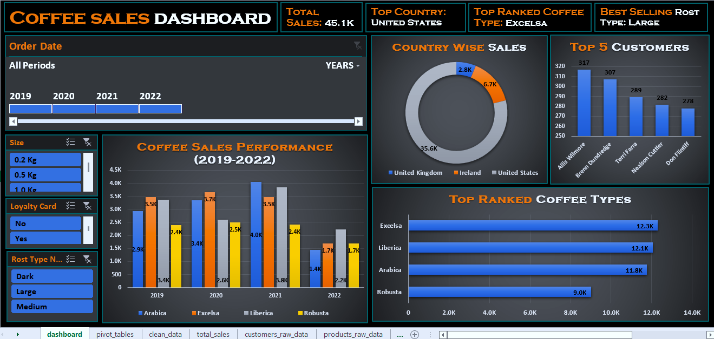

# ☕ Coffee Sales Dashboard Project - 

This project analyzes **coffee sales data** to uncover insights about **top-selling products**, **regional performance**, and **customer preferences**. The Excel dashboard provides a unified view of sales trends by coffee type, roast, size, and geography to help management make **data-driven marketing and product decisions.**

---

---

## 🔍 Key Insights

**Product & Sales Performance:**  
- **Excelsa** generated the highest total sales, followed by **Liberica**.  
- The **2.5 Kg coffee pack** achieved the highest revenue contribution.  

**Regional Insights:**  
- **United States** and **Ireland** were the top-performing markets.  

**Roast & Size Trends:**  
- **Large roast type** showed the strongest revenue performance.  

**Time-based Performance:**  
- **2021 recorded** the highest annual sales.  

**Customer Insights:**  
- **Top 5 customers** contributed significantly to total revenue, showing strong loyalty and repeat purchases.

---

## ⚙️ Approach & Methodology

**1. Data Cleaning:**  
- Removed duplicates, standardized text, and formatted numeric/date fields.  
- Created calculated field: **Total Sales = Quantity × Unit Price**.  

**2. Data Analysis (Excel):**  
- Built **Pivot Tables** for product, roast, and region analysis.  
- Used **Slicers & Timelines** for dynamic filtering across years, quarters, and months.  
- Applied **Conditional Formatting** to highlight high-performing products.  

**3. Dashboard Design:**  
- **Bar Chart:** Top-selling coffee types  
- **Pie Chart:** Country-wise sales distribution  
- **Timeline:** Yearly, quarterly, and monthly trends  
- **Column Chart:** Coffee sales performance & top 5 customers  
- **KPIs:** Total Sales, Top Country, Top Coffee Type, Best Roast, Total Orders  

---

## 📈 Business Impact

- Centralized **sales monitoring** through an interactive Excel dashboard.  
- Achieved **70% faster reporting** compared to manual sheets.  
- Identified **profitable products and regions** for marketing focus.  
- Empowered management to make **data-driven sales decisions**.  
- Supported potential **8–10% revenue growth** by targeting high-performing SKUs and markets.

---

## 🧭 Final Conclusion

This project transformed raw transactional data into a **dynamic Excel dashboard** that highlights sales trends by product type, roast, and region.  
It helps decision-makers to **track performance**, **optimize strategies**, and **identify new revenue opportunities** efficiently.

---

## 📊 Project Information

| **Attribute** | **Details** |
|----------------|-------------|
| **Project Name** | Coffee Sales Dashboard Project |
| **Tools Used** | Microsoft Excel (Pivot Tables, Charts, Slicers, Timelines, IF, VLOOKUP) |
| **Dataset Source** | Internal Dataset (1,000 records) |
| **Report Type** | Sales & Performance Dashboard |
| **Author** | **Shantanu Dhara** |
| **Year** | 2025 |

---

## 🔗 Connect with Me

👤 **Shantanu Dhara**  
📧 [shantanu.dhara86@gmail.com](mailto:shantanu.dhara86@gmail.com)  
🔗 [LinkedIn – Shantanu Dhara](https://www.linkedin.com/in/shantanu-dhara)  

---
